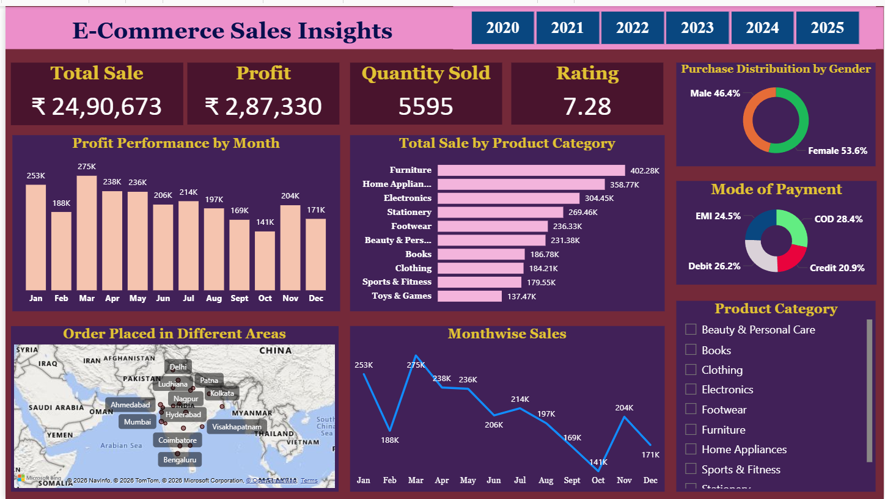

# E-commerce-Sales-Insights

## 📊 Project Overview
This project presents an interactive Power BI dashboard analyzing E-commerce sales performance. It provides insights into sales, profit, customer behavior, and product trends to support data-driven business decisions.

## 🔧 Tools Used
- Power BI  
- Excel  

## 📈 Key Insights
- Total Sales: ₹24,90,673  
- Total Profit: ₹2,87,330  
- Quantity Sold: 5,595  
- Average Rating: 7.28  

- Monthly profit trend analysis to identify peak and low-performing months  
- Product category-wise sales performance (Furniture, Electronics, Clothing, etc.)  
- Gender-based purchase distribution  
- Payment mode analysis (COD, Credit, Debit, EMI)  
- Region-wise order distribution across major cities in India  
- Year-wise filtering (2020–2025) for trend comparison  

## 📂 Files Included
- Power BI Dashboard (E-Commerce Sales Insights.pbix)  
- Dataset (E-Commerce Sales Data.xlsx)  
- Dashboard Screenshot (Dashboard.png)  

## 📷 Dashboard Preview

